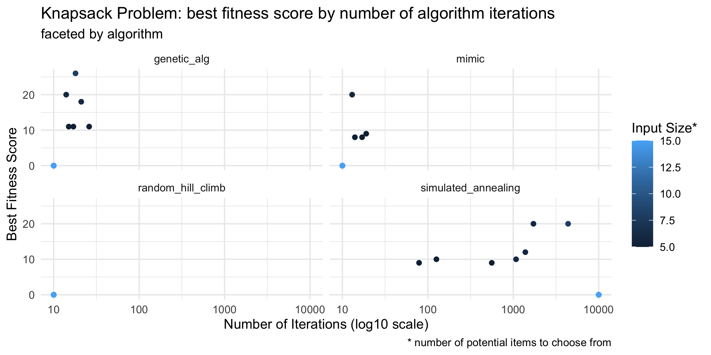
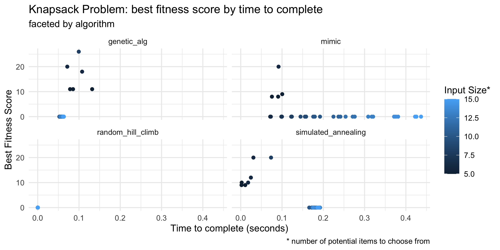
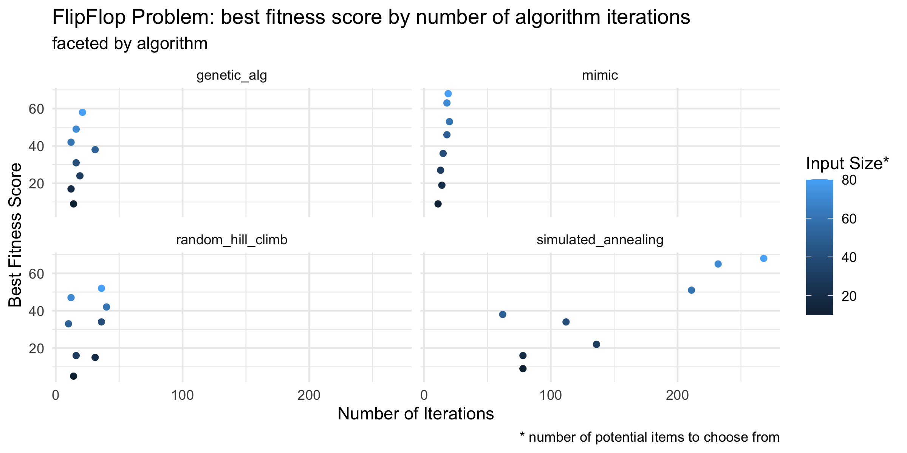
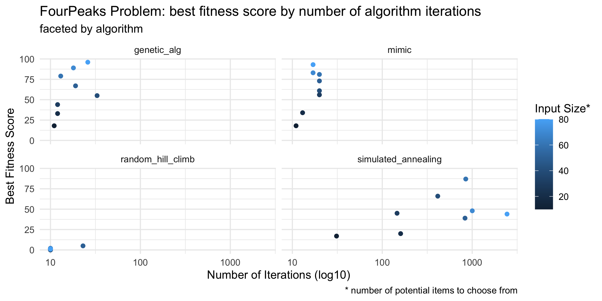
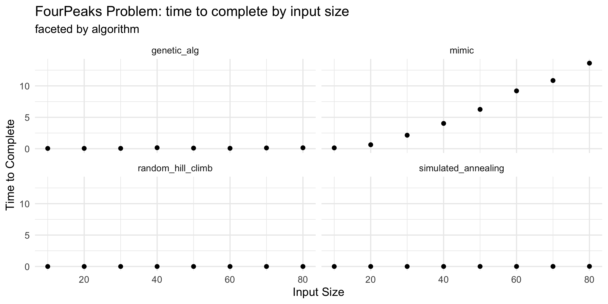
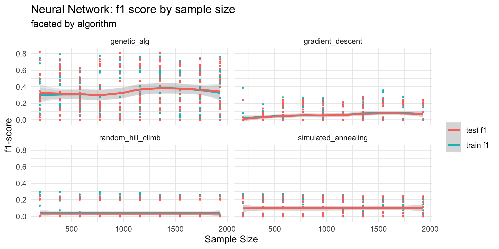
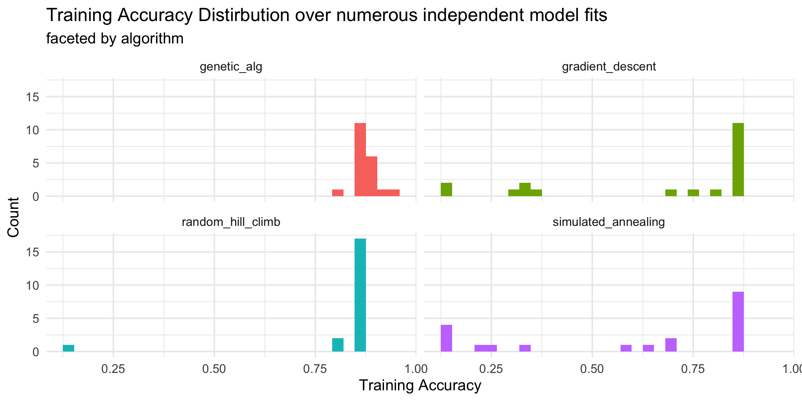

#### CS7641 Assignment 2
##### Joshua Ruf

### 3 Random Optimization Problems

This section explores three random optimization problems: the knapsack problem, the flip-flop problem, and the 4 peaks problem. In brief, the knapsack problem represents a complicated hypothesis space with a high degree of dependence between inputs. The flip-flop problem is much simpler where each input is dependent only on its immediate neighbors. Finally, the 4 peaks problem has a moderate level of complexity, driven by the fact that the global optimum is unlikely to be stumbled upon by more brute-force approaches.

#### Problem 1: Knapsack Problem

The [knapsack problem](https://mlrose.readthedocs.io/en/stable/source/fitness.html#mlrose.fitness.Knapsack) involves trying to fill a knapsack with as many items as possible given each item's value and weight, subject to the condition that the knapsack not exceed some weight threshold. This problem lends itself to a genetic algorithm (GA) because the way in which each input affects the fitness function is highly related to the other inputs. For example, suppose the knapsack is already at capacity, then adding an additional item would either cause the knapsack to be overfull (thus making the fitness zero), or require removing some other items to make room. GA's crossover step should serve as a way to get around this issue since we can think about it as combining half of the contents of two different knapsacks into one knapsack. This kind of large change crossover event helps the algorithm get out of local optimas, particularly necessary here since removing items strictly lowers the fitness while adding items to an already full knapsack pushes the fitness to zero. Put another way, the solution space is likely not very smooth and as such will require some large "steps" to get away from the current solution.

The above figure shows the best fitness score by number of iterations (given early stopping conditions) for each of the four algorithms. Input size is also varied to understand how well these algorithms can handle scaling dimensionality of the problem. As seen, the GA performs the best in terms of fitness and also performs far fewer function calls than simulated annealing. It needs more function calls than MIMIC, but since GA is far less computationally onerous this is still a win as seen in the second figure, which showcases the relationship between fitness and time to complete. Interestingly, at the number of potential items in the knapsack increases, none of the algorithms perform very well. I think the hypothesis space is too vast at this point and algorithms are essentially relying on stumbling into a good approximation which becomes increasingly unlikely. Moreover, randomized hill climb (RHC) performs terribly even at low dimensions, I think this is because the hypothesis is not very smooth and wherever RHC starts it is likely to get stuck almost immediately.

##### Next Steps

To improve these results, I would start by increasing the mutation probability so as to encourage exploring more of the hypothesis space. In doing this I could also seek a parallelized implementation of GA and increase the population size accordingly.

#### Problem 2: FlipFlop

The [flip-flop problem](https://mlrose.readthedocs.io/en/stable/source/fitness.html#mlrose.fitness.FlipFlop) involves maximizing the number of sequential bit flips in an array of bits (i.e. 0 to 1 or 1 to 0). This problem lends itself to simulated annealing because the dependencies between inputs is limited to a bit's immediate neighbours. To be fair, this type of problem also lends itself to RHC, however I think because changes to a single bit that improve fitness are likely to propagate through the state, this allows simulated annealing's desire to explore and not always choose the "best" new state could be beneficial.

The performance of the simulated annealing algorithm is about on par with MIMIC and above that of GA and RHC. Yes, it requires the most iterations out of all of these algorithms, however it is computationally inexpensive relative to MIMIC and GA, and offers enough of a performance boost over RHC to be worth the extra iterations. What could be a problem however is the algorithm's inability to scale as the length of input grows. In the second figure we see that the number of iterations grows the fastest for the simulated annealing algorithm over the other three, and the final input size was only 80 in this experiment. Though even with a large increase to the input length, given enough iterations, I believe simulated annealing would still perform well on FlipFlop because the hypothesis space is rather smooth (at least relative to the knapsack problem above). An algorithm like RHC performs worse in my view because it is unable to take a slightly suboptimal step that would propagate changes through the state that would be beneficial, but simulated annealing can (with some probability) make those steps that lead to more desirable steps. Put another way, RHC is too greedy to perform best on this problem while simulated annealing is able to balance the tradeoff between improving fitness at present, and exploring such that fitness may be improved in the future.

##### Next Steps

To improve upon these results I would play with the starting temperature as a hyperparameter. In a higher dimensional setting it might be desirable to give the algorithm a preference of exploration over exploitation.

#### Problem 3: FourPeaks

The [four peaks problem](https://mlrose.readthedocs.io/en/stable/source/fitness.html#mlrose.fitness.FourPeaks) involves finding the maximum over a continuous but jagged function that has several local optima. It's tricky because there is a high probability that the starting position will be much closer to a local optima than the global optima, and this probability increases as the input length increases. This problem lends itself to MIMIC for several reasons. First, other algorithms are likely to get stuck at local optimas since they cannot "explore" enough to find their way onto another path. Second, because the global optima is so slim and the local optimas are so wide, some understanding of the space will make finding the global optimum much easier. MIMIC's approach of considering all states that meet some threshold will always include the global optimum and therefore the algorithm reduces the possibility of excluding the best solution at the outset and wasting computation. This is in contrast to algorithms like RHC which after making several steps in any direction are unlikely to undo that effort in future steps.

Of the four algorithms, MIMIC appears to be the most reliable on this problem. RHC performs very poorly, while simulated annealing performs generally well, but with a much higher variance of results, even when the number of iterations is high. This to me suggests that both of these algorithms get stuck in local optimas, and no number of iterations will get them out. Conversely, GA and MIMIC perform well on this problem, but MIMIC is still the most reliable in terms of fitness. Of course, MIMIC comes at a cost, that being computational complexity. We can see in the second figure that the three other algorithms' completion times are relatively flat with input size while MIMIC's grows mostly linearly (at least at these low input lengths). Still, this does call into question how feasible it would be to run this algorithm with larger input lengths.

##### Next Steps

To improve these results I would vary some of the algorithm's hyperparameters, chiefly population size and the percentage of the population to be used at each iteration. Of course, MIMIC is already computationally intensive so I would only want to increase these parameters if the more conservative parameters yielded poor results.

### Neural Network Training

I trained a neural network with a single fully connected hidden layer with 8 dimensions. The loss function used was log-loss and the activation function is sigmoid. To avoid exploding gradients, the weights are clipped to the range of (-5, 5). In the previous assignment training the neural network with gradient descent achieved a final f1-score of 0.880546 on training and 0.942857 on testing. On this assignment, the best results actually came from the genetic algorithm, with 0.7631 on training and 0.7321 on testing. I ran the four different algorithms 8 times each to see what kind of range of results came about with different starting positions. Interestingly, these model fitting algorithms resulted in significantly higher variance of results than when training with backpropagation in pytorch. There could be several reasons for this finding:

1. In the previous assignment I iterated over the same dataset multiple times and stopped training when the validation loss started to decrease, while in this assignment I iterated over the data a predetermined maximum number of times.
2. In the previous assignment I oversampled positive examples to deal with class imbalance and here I did not. Given the data's class imbalance this likely made it difficult for the model to outperform (in terms of accuracy) merely guessing false for all examples and achieving an accuracy of about 86%.
3. In the previous assignment I used some dropout between layers to prevent overfitting. This seemed to have worked well, however in this case I don't think we've trained long enough for overfitting to become a problem.
4. Finally, [mlrose](https://mlrose.readthedocs.io/en/stable/index.html), the python package I used for this assignment sets the loss function as log-loss for classification problems by default and does not give the ability to change this setting. On the previous assignment I used f1-score as I read it was well suited to class imbalance. In practice these metrics are pretty similar so I didn't see this as a substantial issue however it is worth noting.

I think I'm most surprised by two things. First, the high variance of results for each algorithm. It seems to me that these results are largely a function of the starting position of each algorithm. That said, it seems likely in this case the starting position is so important because I did not run enough iterations for each algorithm to find a performant solution. Second, I was shocked by how quickly the genetic algorithm was able to find a decent (but still not great) solution to the problem. I had heard that GAs are described as the "second best solution" to any problem and maybe this is evidence of that.

In the case of the RHC and simulated annealing, it seems like as in the previous part of this assignment, they quickly find some local maximum and have a hard time getting out of that neighborhood. The hypothesis space of the neural network weights is smooth, however the sigmoid functions could make parts of it near-jagged. As well, each weight is highly dependent on the surrounding weights and more generally, the entire network as whole. I believe the GA works well in this scenario because it can be thought of as a kind of "pseudo transfer learning" whereby some members of the population have small subsets of weights that are beneficial and through crossover combinations of performant weights from different subsets of the network together to boost fitness. I think this example speaks to the GA's ability to sample widely from the hypothesis space and take disjointed steps to avoid local optimums. Even gradient descent, which should be thought of here as a benchmark, has a pretty wide array of accuracies. To me this likely point to something being awry, and further investigation being needed.

##### Next Steps

To improve upon these results I would seek to run each algorithm with more iterations. As well, because I feel that the choice of starting position is so important, perhaps I would devote more resources to restarts and less to deep search of each position. Perhaps there's a combination of these techniques that performs even better. For example, what if search started off with MIMIC or GA to explore the space and then as the space was better understood, a more simple and computationally cheap algorithm like RHC was employed to finish the job. I think that highlights a key difference between some of the more "simple" randomized optimization algorithms like RHC and simulated annealing and the more "involved" ones like GA and MIMIC: GA and MIMIC are efficient at searching a vast and complicated parameter space but with that they are relatively inefficient at exploiting the current state. Conversely RHC is great at exploiting the current state but cannot branch into new and unexplored territories.

An interesting question would be how many RHC tasks are equivalent to a single MIMIC or GA task. Sure MIMIC and GA tend to perform better on more complicated problems, but they're much more computationally involved so there is obviously a trade off. Yet, as the parameter space grows, RHC would be unlikely to be able to search it effectively. This follows from similar reasoning as the curse of dimensionality: exponentially growing amounts of data are needed to be able to generalize to unseen data. GA algorithms seem to rely on this idea that nothing is off limits, since mutation can (at least in theory) bring about any combination of parameters given enough iterations. With that, could adding a simple mutation parameter to the RHC increase its efficacy? I think a random bit flip could potentially offer a nice halfway point between RHC and GA, combining the benefits of both algorithms.

